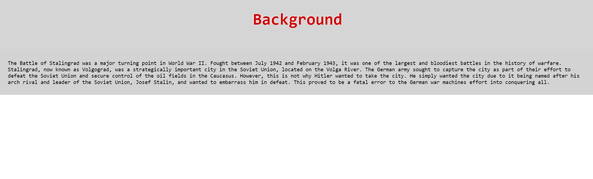
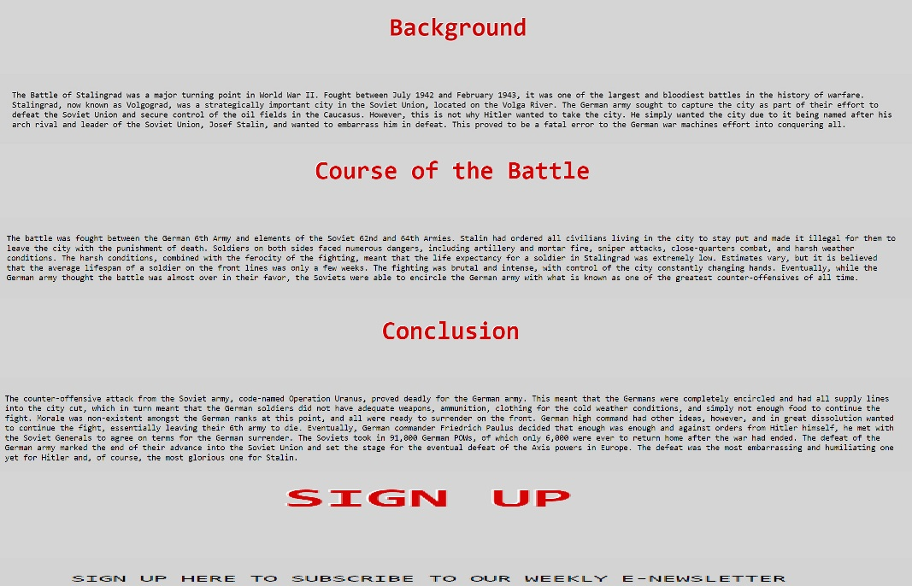
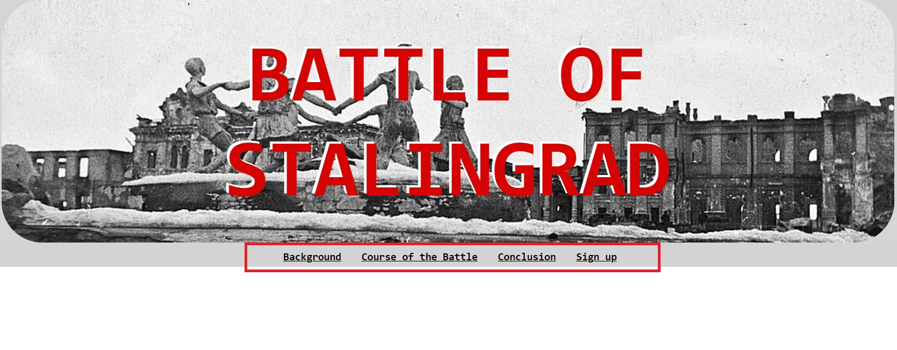
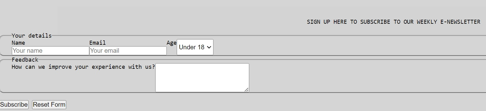

# Battle-Of-Stalingrad
<h1 align="center">Battle of Stalingrad Website</h1>

[View the live project here.](https://masd91.github.io/Battle-Of-Stalingrad/)

This is my HTML & CSS project. I created it to be simple yet informative and to be easy to navigate around whichever device you may want to view it from.

## User Experience (UX)

- ### User stories
  - #### First Time Visitor Goals
    1. First time visitors should be able to see that the purpose of this page is to educate and inform.
    2. They should also be able to easily navigate through the different pages internally and externally.
  - #### Returning Visitor Goals
    1. Returning visitors should be able to easily access different stages of the historical event.
    2. Returning visitors should be able to give feedback on the information provided and also be able to ask questions.
    3. They should also be able to visit appropriate external sites within the community.
  - #### Frequent User Goals
    1. Frequent users should be able to subscribe to an e-newsletter to further their thirst for knowledge.

- ### Design
  - #### Colour Scheme
    - The main colors are grey, black, and red.
  - #### Typography
    - Monospace is being used as the main font of this website to give it the typewriter feel which is appropriate for the time of the event.
  - #### Imagery
    - Images used depict key events and people involved with the event.

* ### Wireframes
  - Home Page Wireframe - [View](https://github.com/)
  - Mobile Wireframe - [View](https://github.com/)
  - Contact Us Page Wireframe - [View](https://github.com/)

## Features
- Responsive on all device sizes
- Interactive elements

## Technologies Used

### Languages Used
- [HTML5](https://en.wikipedia.org/wiki/HTML5)
- [CSS3](https://en.wikipedia.org/wiki/Cascading_Style_Sheets)

### Frameworks, Libraries & Programs Used
1. [Font Awesome](https://fontawesome.com/): Font Awesome was used on all pages throughout the website to add icons for aesthetic and UX purposes.
2. [Git](https://git-scm.com/): Git was used for version control by utilizing the Gitpod terminal to commit to Git and push to GitHub.
3. [GitHub](https://github.com/): GitHub is used to store the project's code after being pushed from Git.

## Testing

The W3C Markup Validator and W3C CSS Validator Services were used to validate every page of the project to ensure there were no syntax errors in the project.

- [W3C Markup Validator](https://jigsaw.w3.org/css-validator/#validate_by_input) - [Results](https://github.com/)
- [W3C CSS Validator](https://jigsaw.w3.org/css-validator/#validate_by_input) - [Results](https://github.com/)

### Testing User Stories from User Experience (UX) Section

- #### First Time Visitor Goals
  1. First time visitors should be able to see that the purpose of this page is to educate and inform.
     - The first page that visitors are greeted with is the background page to kick them off with a little bit of history as to how the event started.
       
     - The main points are clearly explained on each page.
       
     - The user should navigate the nav bar as it shows to receive the information in chronological order.
       
  2. They should also be able to easily navigate through the different pages internally and externally.
     - The site has been designed so that every internal page is easily accessible from the nav bar.
       
     - The site also has the external links in the footer to be easily accessible.
       

- #### Returning Visitor Goals
  1. Returning visitors should be able to easily access different stages of the historical event.
     - These are clearly shown in the navigation bar.
  2. Returning visitors should be able to give feedback on the information provided and also be able to ask questions.
     - The navigation bar clearly highlights the "Sign Up" Page.
     - Here the visitors will be shown a place where they can give open, unlimited feedback.
       
  3. They should also be able to visit appropriate external sites within the community.
     - The social media links can be found in the footer of every page.
     - Once the visitors access each social media page, they will find more information on the event and be able to speak to others in the community.

- #### Frequent User Goals
  1. Frequent users should be able to subscribe to an e-newsletter to further their thirst for knowledge.
     - The user would already be comfortable with the website layout and will know how to navigate to the sign-up page.
     - Once they are here, they will be met with the subscribe section, which will give them access to the e-newsletter.
       

### Further Testing
- The website was tested on Google Chrome, Apple's browser, Internet Explorer, and Firefox.
- The website was viewed on multiple devices, ranging from the latest Samsungs, iPhone 13s, and iPads.
- Pages were tested regularly to ensure all links and media work.
- Friends and family members were asked to review the site to help with design and errors to see if anything was missed.

### Known Bugs
- On the iPad tablet, the footer doesn't stay at the bottom of the page but stays under the content.
  

## Deployment

### GitHub Pages
The project was deployed to GitHub Pages using the following steps:
1. Log in to GitHub and locate the [GitHub Repository](https://github.com/).
2. Select the correct repository (Battle-Of-Stalingrad in this case).
3. Click on "Settings" in the nav bar.
4. In the left navigation, click on "Pages."
5. Set the "Source" to "Main Branch" and the "Directory" to "/root."
6. Wait a few minutes for the link to appear at the top of the page.

### Forking the GitHub Repository
To fork the GitHub Repository and make a copy of the original repository on your GitHub account, follow these steps:
1. Log in to GitHub and locate the [GitHub Repository](https://github.com/MasD91/Battle-Of-Stalingrad).
2. Click on the "Fork" button at the top of the repository page.
3. You will now have a copy of the original repository in your GitHub account.

### Making a Local Clone
To make a local clone of the repository, follow these steps:
1. Log in to GitHub and locate the [GitHub Repository](https://github.com/MasD91/Battle-Of-Stalingrad).
2. Click on the "Clone or download" button.
3. Copy the URL under "Clone with HTTPS."
4. Open Git Bash and navigate to the directory where you want to clone the repository.
5. Run the following command: `git clone [URL]`, replacing [URL] with the URL you copied.
6. Press Enter and wait for the clone to complete.

$ git clone (https://github.com/MasD91/Battle-Of-Stalingrad)

Click [Here](https://help.github.com/en/github/creating-cloning-and-archiving-repositories/cloning-a-repository#cloning-a-repository-to-github-desktop) for more detailed instructions and screenshots.

## Credits

### Code
- The majority of the code was written by the developer.

### Content
- All content was written by the developer.
- Psychological properties of colors text in the README.md was found [here](http://www.colour-affects.co.uk/psychological-properties-of-colours).

### Media
- Hitler image was taken from [here](https://www.britannica.com/list/9-things-you-might-not-know-about-adolf-hitler).
- Stalin image was taken from [here](https://www.britannica.com/biography/Joseph-Stalin).
- German surrender image was taken from [here](http://www.nww2m.com/2013/02/70th-anniversary-of-the-german-defeat-at-stalingrad/).
- YouTube video was taken from [here](https://www.youtube.com/watch?v=5PGxUfdrnk4&ab_channel=vladimirgaming).
- Header image was taken from [here](https://en.wikipedia.org/wiki/Battle_of_Stalingrad).

### Acknowledgements
- My mentor, Dario, helped me a lot along the way.
- A developer friend, Ainsley Chang, also provided valuable assistance.
- Tutor support at Code Institute for their support.
